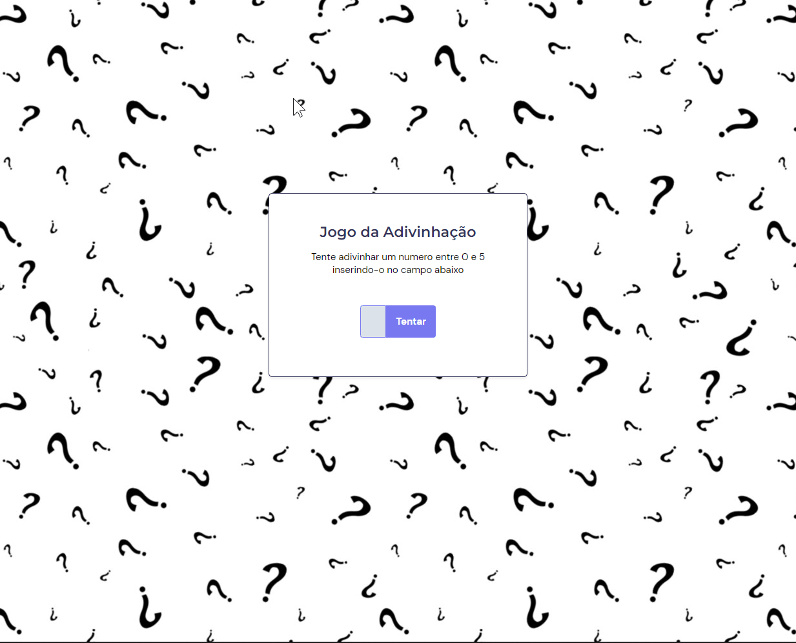

<h1 align="center"> Jogo Adivinhação - Adivinhe um numero! </h1>

Exercício de fixação de HTML, CSS e JavaScript da Rocketseat para ensino de tecnologias WEB.

  <a href="#-tecnologias">Tecnologias</a>&nbsp;&nbsp;&nbsp;|&nbsp;&nbsp;&nbsp;
  <a href="#-projeto">Projeto</a>&nbsp;&nbsp;&nbsp;|&nbsp;&nbsp;&nbsp;
  <a href="#memo-licença">Licença</a>

  

 

  

## 🚀 Tecnologias

Esse projeto foi desenvolvido com as seguintes tecnologias:

- HTML e CSS
- JavaScript

## 💻 Projeto

A página Jogo de Adivinhação é um exercício de fixação de HTML, CSS e JavaScript. Ele é completamente responsivo, e gera um numero aleatório toda vez que a página é carregada, a qual é comparado com o numero que o usuário insere e que se acerta, ganha o jogo.

## 📔 Licença

Esse projeto está sob a licença MIT.

---

Feito com ♥ by Rocketseat :wave: [Participe da nossa comunidade!](https://discord.gg/rocketseat)
